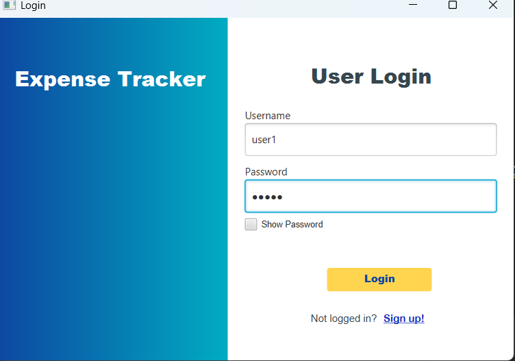
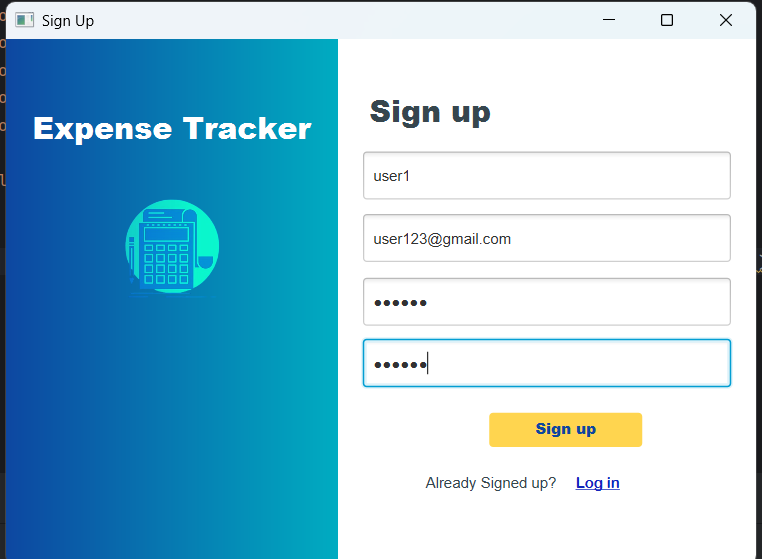
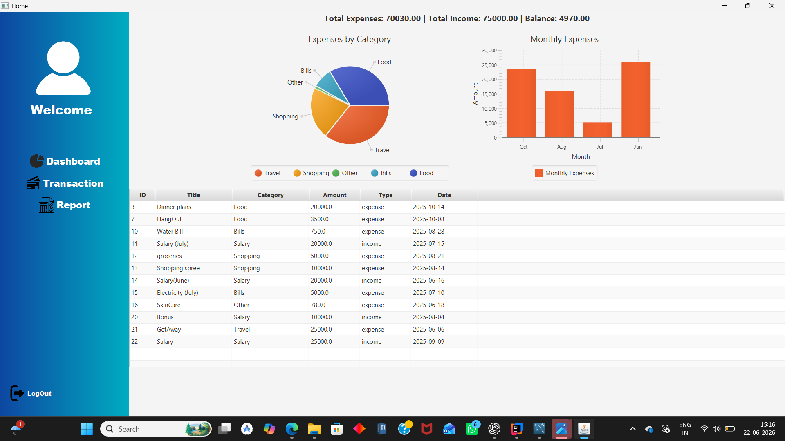
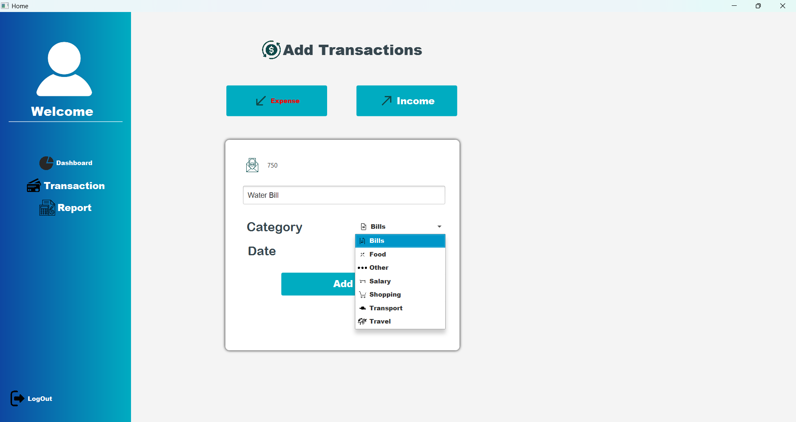
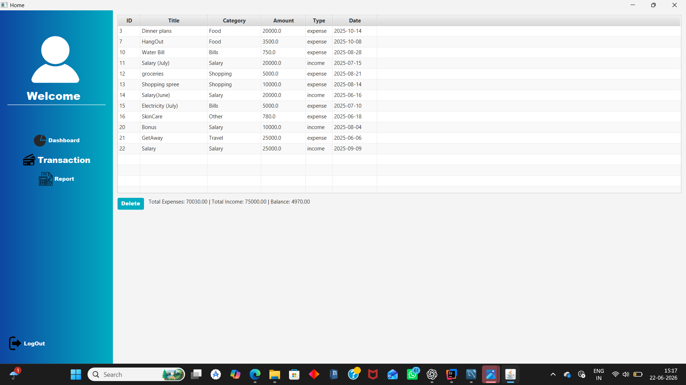

# Expense Planner

A desktop Expense Planner application built using Java, JavaFX, MySQL, JDBC, and Maven. The application helps users manage their personal finances by tracking income, expenses, and generating financial reports through an intuitive graphical interface.

## Features

* User Registration and Login Authentication
* Income and Expense Tracking
* Category-based Transaction Management
* Dashboard with Financial Overview
* Monthly and Category-wise Reports
* Data Visualization using Charts
* MySQL Database Integration
* CRUD Operations for Transactions
* User-specific Financial Records

## Technologies Used

* Java 21
* JavaFX
* MySQL
* JDBC
* Maven
* Scene Builder

## Project Structure

```text
ExpensePlanner
├── src
│   ├── main
│   │   ├── java
│   │   └── resources
├── pom.xml
├── mvnw
├── mvnw.cmd
└── config.properties.example
```

## Screenshots

### Login Page



### Sign Up Page



### Dashboard



### Transaction Management



### Reports & Analytics



## Database Configuration

Create a file named:

```text
src/main/resources/config.properties
```

using the template provided in:

```text
config.properties.example
```

Example:

```properties
db.url=jdbc:mysql://localhost:3306/javafx
db.user=root
db.password=your_password
```

## Database Setup

Create a MySQL database:

```sql
CREATE DATABASE javafx;
```

Create the required tables and import the schema used by the project.

## Installation

Clone the repository:

```bash
git clone https://github.com/mlb-12/ExpensePlanner.git
cd ExpensePlanner
```

Run the application:

```bash
./mvnw javafx:run
```

For Windows:

```bash
mvnw.cmd javafx:run
```

## Key Learning Outcomes

* JavaFX GUI Development
* Maven Project Management
* JDBC Database Connectivity
* User Authentication Systems
* Data Processing and Reporting
* Desktop Application Development
* Software Project Structuring

## Future Improvements

* Budget Planning and Alerts
* Export Reports to PDF/Excel
* Cloud Database Integration
* Multi-device Synchronization
* Advanced Financial Analytics
* Dark Mode Support

## Author

Hanan Aslam

GitHub: https://github.com/mlb-12
